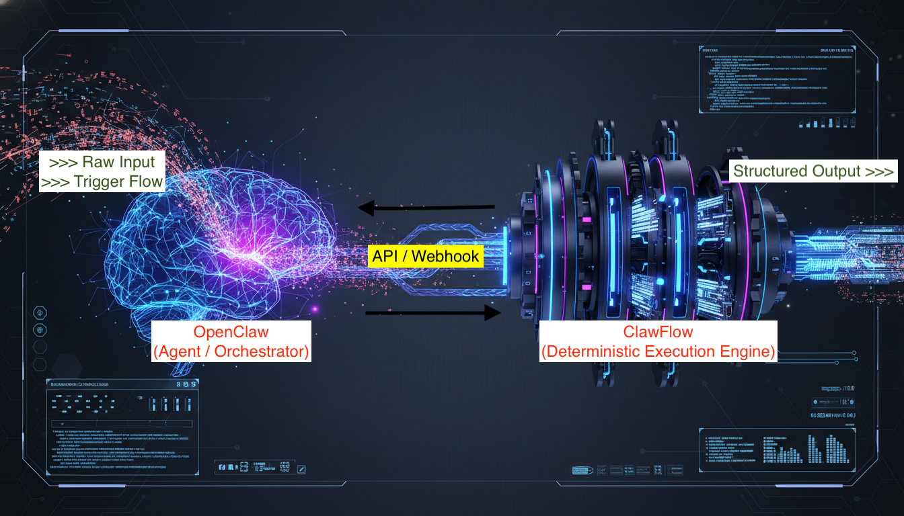
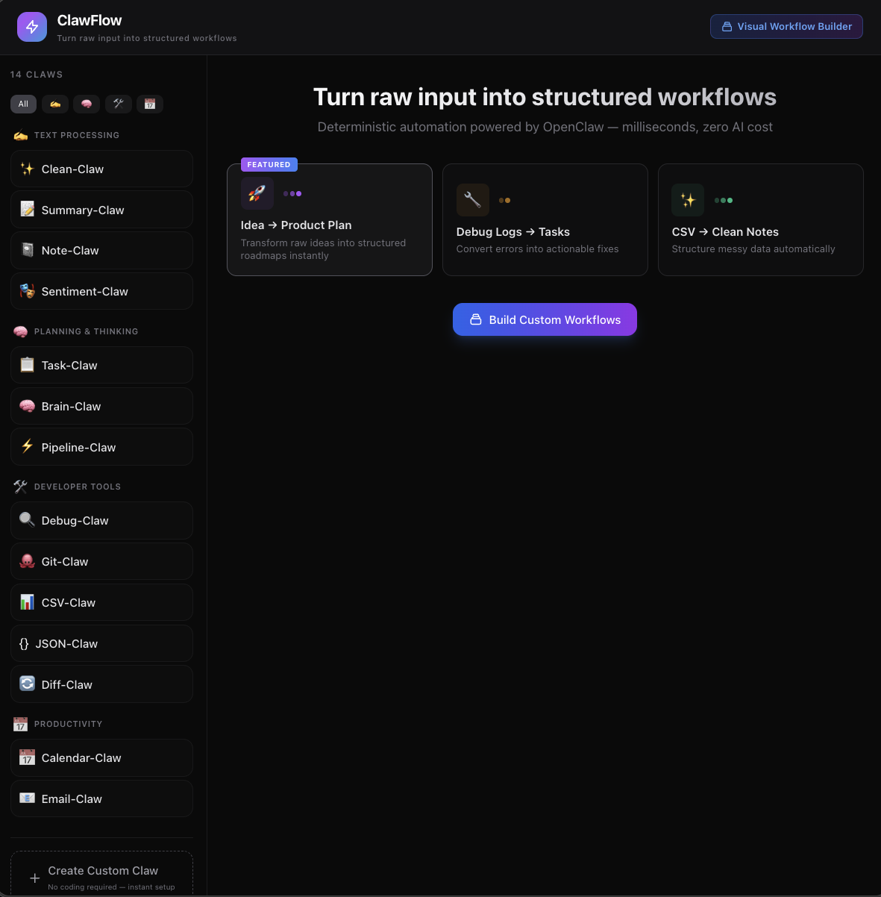
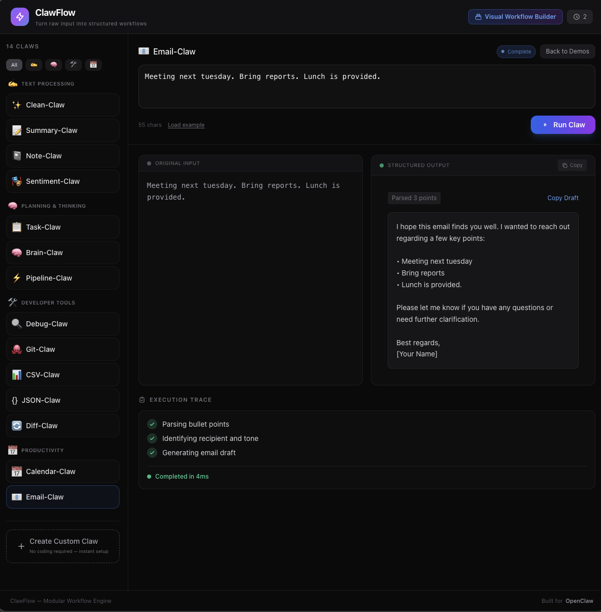
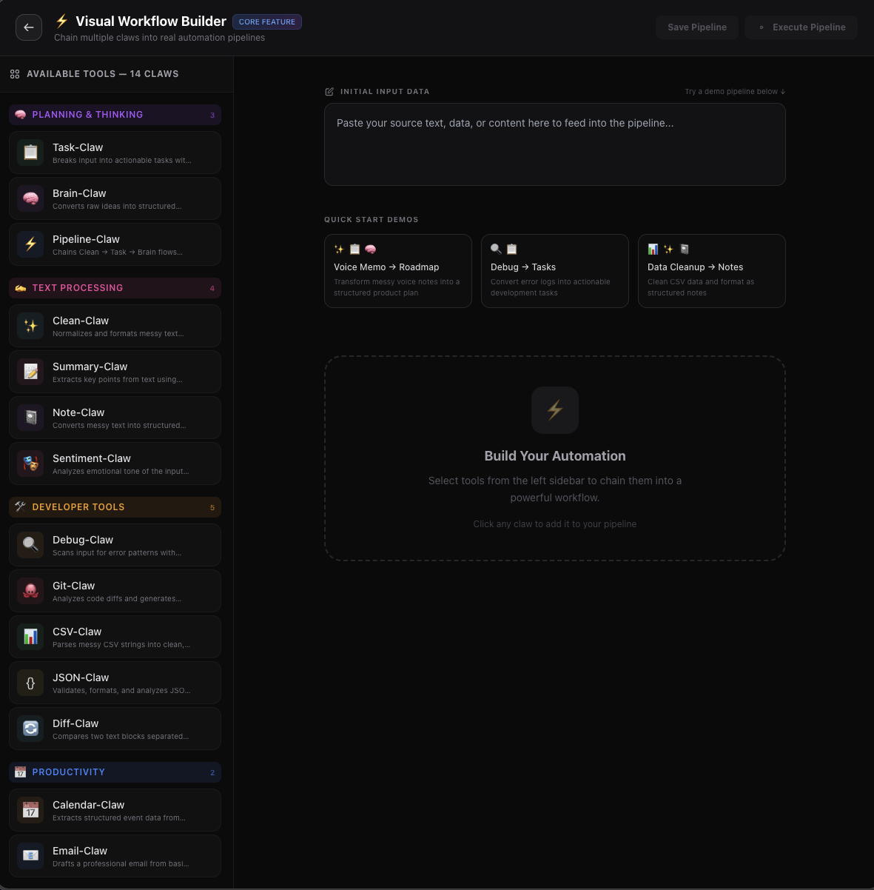
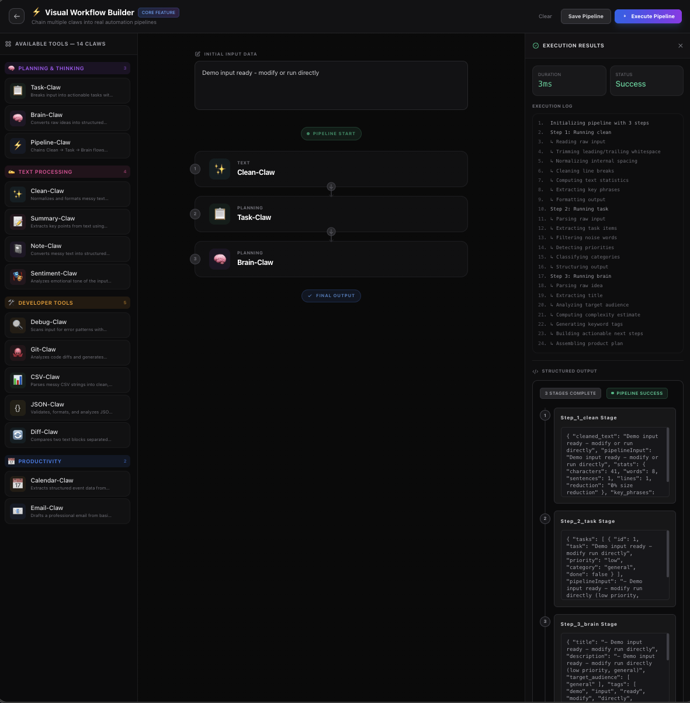
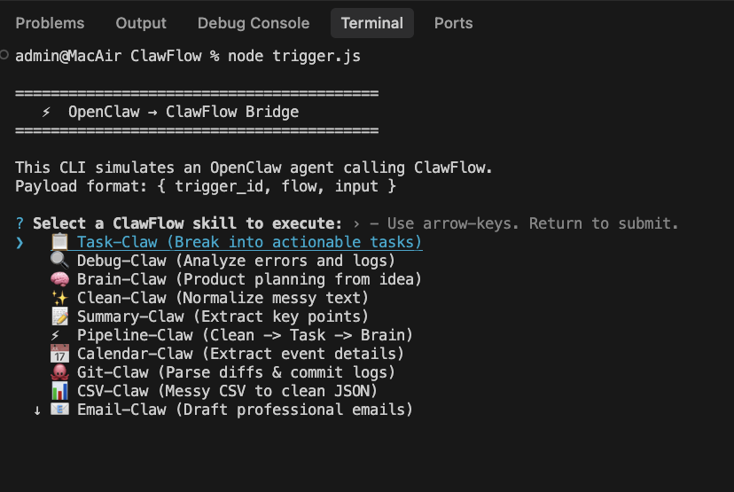
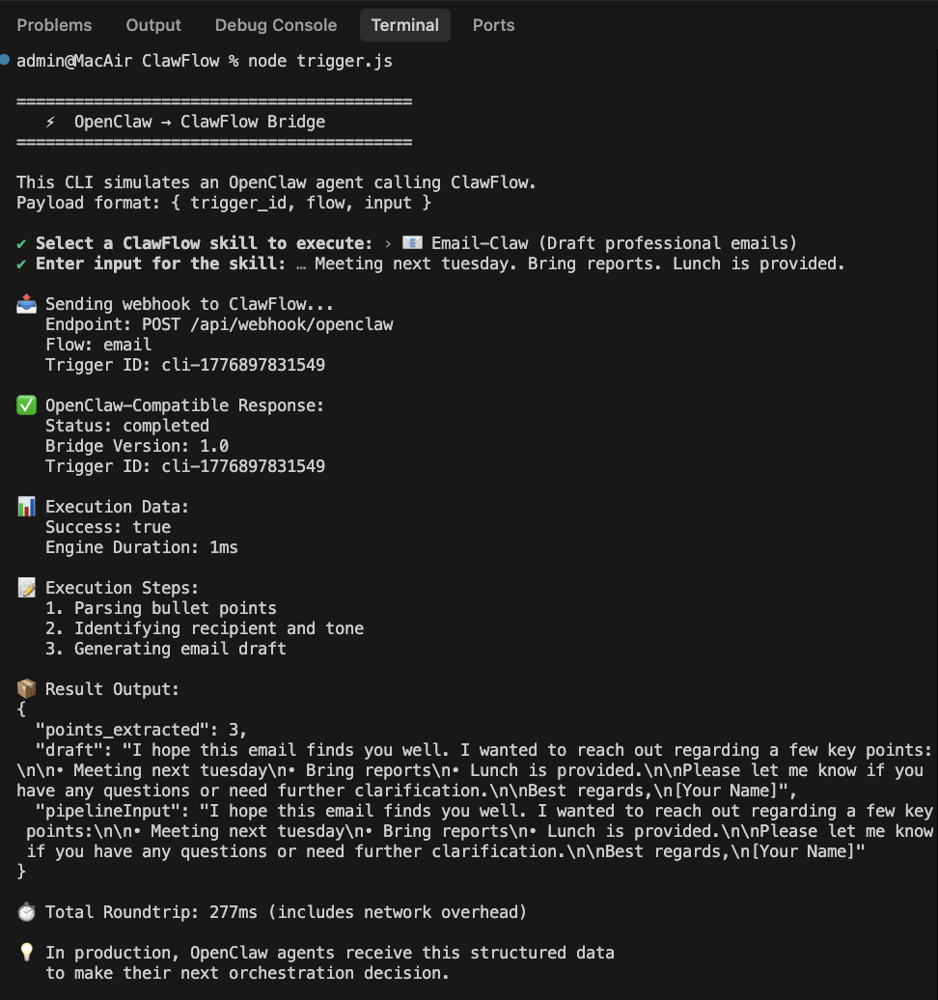

# ⚡ ClawFlow v2.1

### **The Deterministic Execution Backend for OpenClaw Agents** : (OpenClaw = brain, ClawFlow = muscle) 

> **The problem:** AI agents are great at reasoning, but when you need something done *reliably and instantly*, they fall apart.  
> **The solution:** ClawFlow is a fast, deterministic execution layer that OpenClaw agents call for structured data transformation — parsing, validation, and workflow orchestration in milliseconds.

Live: **[https://clawflow-engine/ →](https://clawflow-engine.vercel.app/)**
---

## 🧠 The Idea

Automation today forces a false choice: expensive, unpredictable AI APIs or rigid, unmaintainable scripts. ClawFlow offers a third option — **AI-optional, deterministic-first execution**.

**For OpenClaw Agents:** While the agent handles intent recognition and orchestration decisions, ClawFlow provides a reliable execution backend for tasks that need precision, not creativity.

- **AI-optional, deterministic-first** — Same input always produces the same output.
- **Modular skills** — Each flow is an independent, self-contained skill.
- **Visual Orchestration** — Chain skills into complex pipelines.
- **Real Persistence** — Every execution stored with full traceability.
- **Sub-5ms execution** — Fast enough to run in agent loops without blocking.

---

## 🚀 Features (v2.1)

| Feature | Description |
|---------|-------------|
| **14 Built-in Skills** | Deterministic execution for parsing, validation, and transformation |
| **Visual Claw Creator** | Create custom claws in seconds — no coding required |
| **11 Pre-built Templates** | Uppercase, task extraction, link parsing, JSON formatting, and more |
| **OpenClaw Webhook Bridge** | Native integration via `/api/webhook/openclaw` with API key auth |
| **Visual Pipeline Builder** | Chain skills into complex workflows at `/pipeline` |
| **SQLite Persistence** | Full execution history with timing and traceability |
| **22-Test Suite** | Production-ready reliability |
| **Sub-5ms Execution** | Fast enough for real-time agent loops |
| **Rich Output Renderers** | Structured data visualization |

---

## 🎯 The 3 Killer Workflows

Instead of listing all 14 skills, here are the workflows that demonstrate ClawFlow's power for OpenClaw agents:

### 1. Voice Memo → Structured Roadmap
**Input:** *"Build landing page, setup auth urgently, deploy by Friday"*  
**Pipeline:** `Clean-Claw → Task-Claw → Brain-Claw`  
**Output:** Structured product plan with prioritized phases and deadlines  
**Use case:** OpenClaw agent captures voice input, delegates parsing to ClawFlow, receives structured data to present or act on.

### 2. Error Log → Actionable Tasks
**Input:** Raw server logs with stack traces  
**Flow:** `Debug-Claw`  
**Output:** Severity-classified issues with suggested fixes  
**Use case:** Agent monitors logs, calls ClawFlow for analysis, routes critical errors to alerts.

### 3. Messy Data → Clean Structure
**Input:** Unformatted CSV, JSON, or text  
**Flow:** `CSV-Claw`, `JSON-Claw`, or `Clean-Claw`  
**Output:** Validated, normalized structured data  
**Use case:** Agent extracts data from various sources, ClawFlow ensures it's clean before processing.

### All 14 Skills

<details>
<summary>Click to see all available skills</summary>

| Flow | Icon | Description |
|------|------|-------------|
| **Task-Claw** | 📋 | Breaks input into actionable tasks with priority detection |
| **Debug-Claw** | 🔍 | Scans for error patterns with severity classification |
| **Brain-Claw** | 🧠 | Converts raw ideas into structured product plans |
| **Clean-Claw** | ✨ | Normalizes messy text with stats extraction |
| **Summary-Claw** | 📝 | Extracts key points using positional scoring |
| **Calendar-Claw** | 📅 | Extracts event details from natural language |
| **Git-Claw** | 🐙 | Parses git diffs and suggests commit messages |
| **CSV-Claw** | 📊 | Parses messy CSV to clean JSON |
| **Email-Claw** | 📧 | Drafts professional emails from bullet points |
| **Note-Claw** | 📓 | Formats markdown notes with keyword tagging |
| **JSON-Claw** | `{}` | Validates and formats JSON strings |
| **Diff-Claw** | ↔️ | Word-level text comparison |
| **Sentiment-Claw** | 😊 | Extracts emotional tone and sentiment score |
| **Pipeline-Claw** | ⚡ | Multi-stage workflow orchestration |

</details>

---

### Screenshots
*ClawFlow Dashboard*   
---

*ClawFlow: Email-Claw* 
---

*Pipeline Builder*  
---

*Rich pipeline output*  
---

*CLI Trigger*  
---

*Email-CLI Trigger*  
---

## 🏗️ Architecture

```
ClawFlow
├── app/
│   ├── api/
│   │   ├── flows/            — list all flows
│   │   ├── run-flow/         — execute a single flow
│   │   ├── run-pipeline/     — execute a custom pipeline
│   │   ├── history/          — fetch execution history from DB
│   │   ├── pipelines/        — save/load visual pipelines
│   │   └── webhook/          — OpenClaw bridge with API key auth
│   ├── pipeline/             — Visual Pipeline Builder UI
│   └── page.tsx              — Main application dashboard
├── lib/
│   ├── db/                   — SQLite + Drizzle ORM persistence
│   ├── engine/               — Standardized execution engine
│   └── flows/                — All 14 independent flow modules
└── trigger.js                — CLI trigger for OpenClaw integration
```
### How It Works

**Standalone Mode:**
```
User Input → API Route → Claw Engine → Flow Registry → Selected Flow → Structured Output
                              ↑                              ↓
                         Validation                   Execution Trace
                         + Timing                     + Result Data
```

**OpenClaw Integration Mode:**
```
┌─────────────────┐     intent recognition       ┌──────────────────┐
│  OpenClaw Agent │ ───────────────────────────→ │  ClawFlow Engine │
│  (The Brain)    │  "Parse this task list"      │  (The Muscle)    │
└─────────────────┘                              └──────────────────┘
         │                                              │
         │    POST /api/webhook/openclaw                │
         │    { flow: "task", input: "..." }            │
         │←─────────────────────────────────────────────┘
         │         structured result (3-5ms)
         ▼
   ┌─────────────┐
   │   Action    │  ← agent makes next decision
   └─────────────┘
```

---

## ⚙️ Getting Started

### Prerequisites

- Node.js 18+
- npm

### Installation

```bash
git clone https://github.com/kanyingidickson-dev/ClawFlow.git
cd ClawFlow
npm install
```

### Development

```bash
npm run dev
```

Open [http://localhost:3000](http://localhost:3000). The database `sqlite.db` is automatically initialized on first run.

### CLI Trigger (OpenClaw-Compatible)

Test the webhook integration locally using the CLI trigger, which sends OpenClaw-format payloads.  
📖 See [`OPENCLAW_INTEGRATION.md`](./OPENCLAW_INTEGRATION.md) for the complete integration guide.

```bash
# Start the dev server first, then:
node trigger.js

# This simulates an OpenClaw agent calling the webhook:
# POST /api/webhook/openclaw
# { "flow": "task", "input": "your text here" }
```

---

## 🔌 API Reference

#### `GET /api/flows`
Returns all available flows with metadata.

#### `POST /api/run-flow`
Execute a single flow.

#### `POST /api/run-pipeline`
Execute a sequence of flows.
**Payload:** `{ "input": "string", "flows": ["clean", "task"] }`

#### `POST /api/webhook/openclaw`
**OpenClaw Integration Endpoint** : Authenticates via `x-api-key` header (if `OPENCLAW_API_KEY` is configured), executes the requested flow, and returns structured data for the agent.

**Request:**
```json
{
  "trigger_id": "oc-999",
  "flow": "task",
  "input": "urgent: fix auth bug, deploy patch"
}
```

**Response:**
```json
{
  "bridge_version": "1.0",
  "trigger_id": "oc-999",
  "status": "completed",
  "execution_data": {
    "success": true,
    "duration": 3,
    "output": {
      "tasks": [
        { "title": "Fix auth bug", "priority": "high" },
        { "title": "Deploy patch", "priority": "normal" }
      ]
    }
  }
}
```

See [`openclaw.config.yml`](./openclaw.config.yml) for a full agent configuration example.

📖 **Full Integration Guide:** [`OPENCLAW_INTEGRATION.md`](./OPENCLAW_INTEGRATION.md) — detailed architecture, examples, and routing strategies.

---

## 🧪 Testing

```bash
npm run test
```
Runs 22 passing tests covering engine core, flow logic, pipeline orchestration, and edge cases.

Execute a flow with input.

**Request:**
```json
{
  "flow": "task",
  "input": "Build landing page, setup auth, deploy app"
}
```

**Response:**
```json
{
  "flow": "task",
  "success": true,
  "steps": ["Parsing raw input", "Extracting task items", "..."],
  "output": { "tasks": [...], "count": 3 },
  "executedAt": "2026-04-17T05:00:00.000Z",
  "duration": 2
}
```

---

## 🎨 Creating Custom Claws (No-Code)

ClawFlow now includes a **Visual Claw Creator** — build custom automation skills in seconds without writing code.

### Quick Create (UI-Driven)

1. Click **"Create Custom Claw"** in the sidebar
2. Choose from **11 pre-built templates**:
   - 🔠 Uppercase/Lowercase Transformer
   - 🔄 Text Reverser
   - ✅ Task Extractor (pulls action items from text)
   - 🔗 Link Extractor (finds URLs)
   - 📧 Email Extractor (finds addresses)
   - 🗂️ JSON Formatter (pretty-print)
   - 📝 Markdown Analyzer
   - 🔢 Word Counter with statistics
   - � Duplicate Line Remover
   - ⚡ Custom (template)
3. Name your claw, pick a category, add an emoji icon
4. Click **Create** — it appears instantly in your sidebar

### How It Works

Custom claws are stored in your browser's localStorage and execute client-side. They:
- Appear in the sidebar alongside built-in claws
- Execute with the same step-by-step animation
- Persist across sessions
- Can be deleted anytime

### Advanced: Code Extension

For unlimited flexibility, developers can still add custom TypeScript flows:

1. Create `lib/flows/myFlow.ts`:

```ts
import { FlowDefinition, FlowResult } from "../engine/types";

export const myFlow: FlowDefinition = {
  id: "my",
  name: "My-Claw",
  description: "Does something useful",
  example: "example input",
  icon: "🔧",
  color: "#8b5cf6",
  execute(input: string): FlowResult {
    return {
      steps: ["Step 1", "Step 2"],
      result: { processed: input.trim() },
    };
  },
};
```

2. Register in `lib/flows/index.ts`:

```ts
import { myFlow } from "./myFlow";
// ...
export const flows = {
  // ...existing flows
  my: myFlow,
};
```

That's it. The flow appears in the UI automatically.
---

## 🛠 Tech Stack

- **Next.js 15** + **React 19**
- **TypeScript** for strict type safety
- **Better-SQLite3** + **Drizzle ORM** for persistence
- **Vitest** for robust test coverage
- **Zod** for API input validation
- **Tailwind CSS** for a premium, animated UI
- **Framework:** Next.js 15 (App Router)
- **Language:** TypeScript
- **UI:** React 19 + Tailwind CSS 3
- **Architecture:** Modular flow-based execution engine
- **API:** RESTful Next.js API routes
- **Styling:** Custom design system with CSS animations

---

## 📄 License

[MIT](https://github.com/kanyingidickson-dev/ClawFlow/blob/main/LICENSE)
